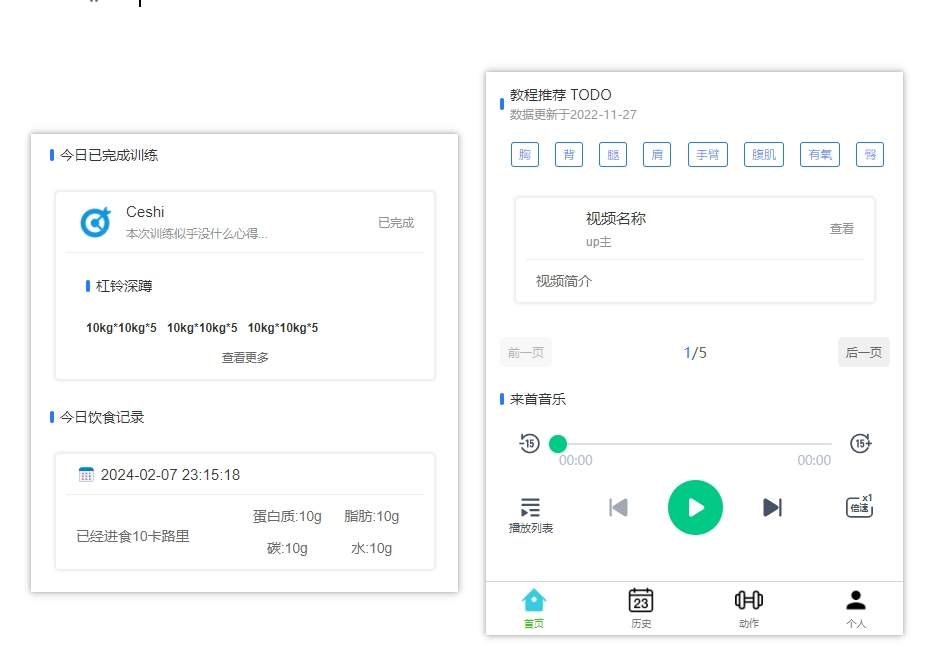
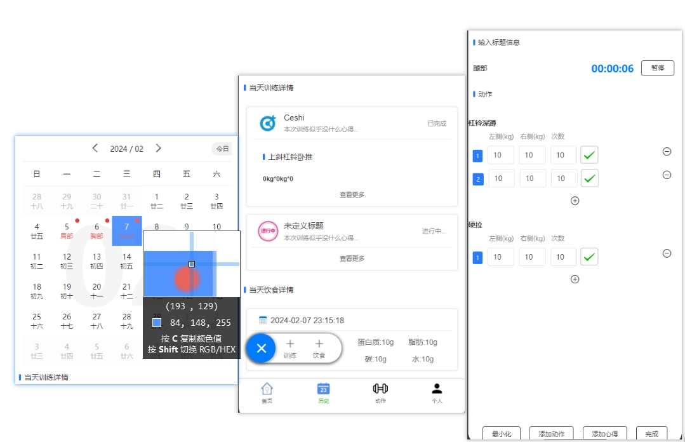
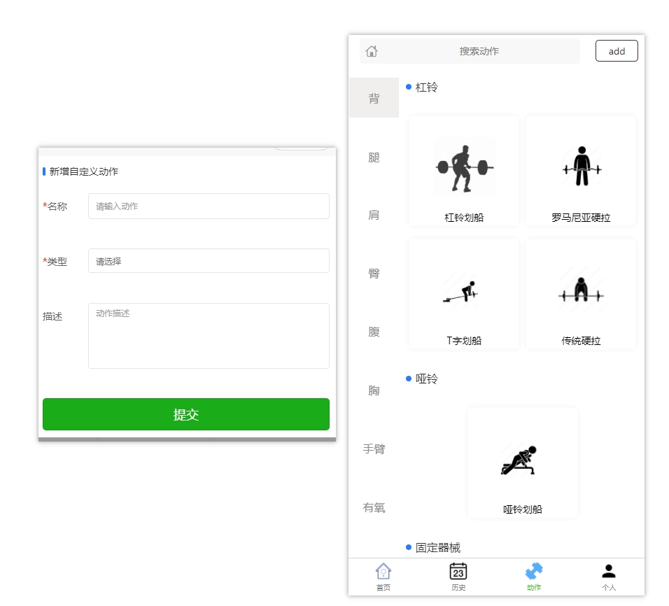
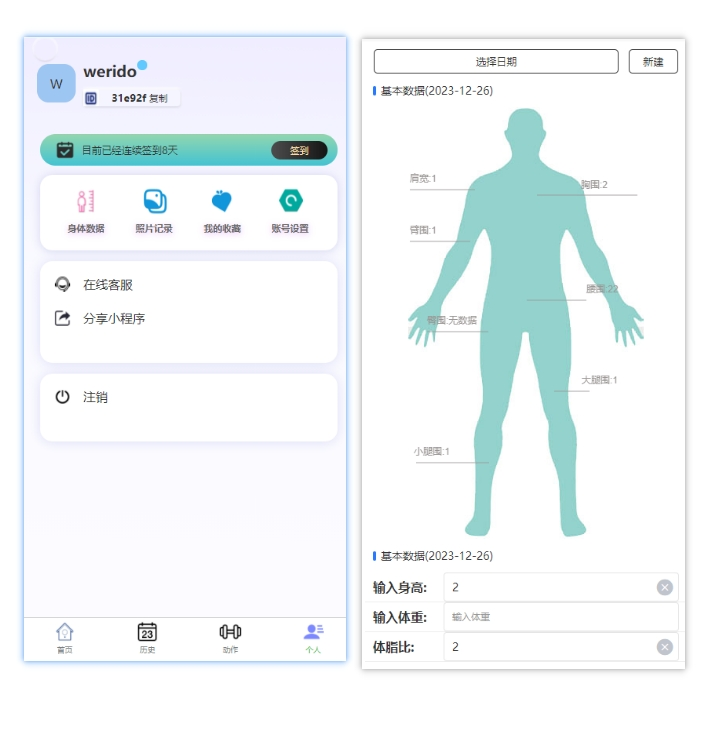

# air-body
一个健身记录软件

### 页面

#### 主页
- [x] 当天训练记录
- [x] 当天饮食记录
- [x] 随机音乐
- [ ] 教学视频(todo)

#### 历史页面
- [x] 新建历史记录
- [x] 新建饮食记录
- [x] 添加动作
- [x] 历史记录
- [x] 训练记录分享

#### 动作管理模块
- [x] 动作列表
- [x] 自定义动作
- [ ] 动作详情
- [ ] 动作教学详情

#### 个人页面
- [x] 信息资料
- [x] 身体信息记录
- [ ] 身体档案分享
- [ ] 照片记录
- [ ] 收藏
- [ ] 设置

#### 计划通知模块
- [ ]  个人训练计划
- [ ] 官方推荐计划
- [ ] 计划消息通知

#### 用户中心

用的现有的[用户中心](https://github.com/weridolin/site-usercenter)

